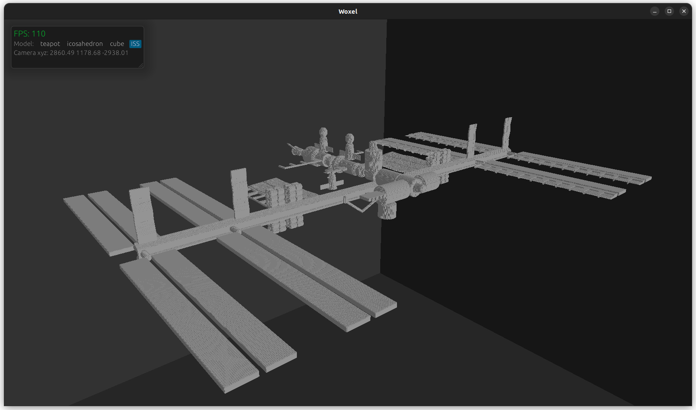
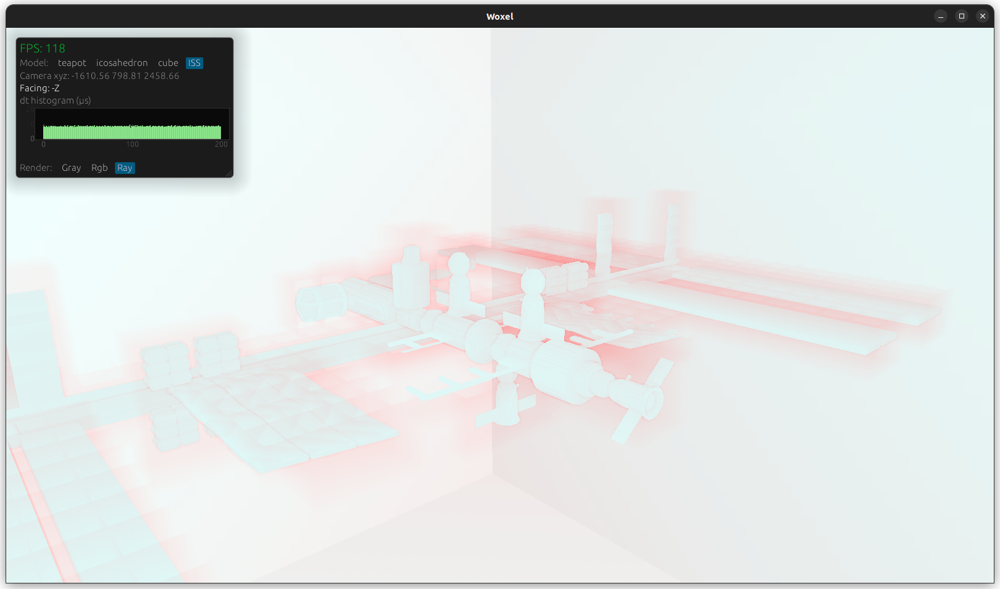
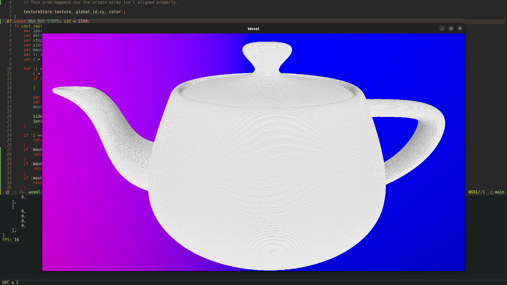

# woxel
Web compatible voxel rendering engine. <br/>
The engine uses the VDB345[^1] data structure. It then performs HDDA[^3] in compute shaders to render the model.



## Instalation
To run the project you will need the Rust nightly toolchain `1.75.0-nightly`[^2].
Easiest way to use the engine is with [cargo](https://doc.rust-lang.org/cargo/).<br/><br/>
For the **developer enviorment**, you can just run: 
``` shell
cargo run --release
```
<br/></br>
To build the **web enviorment**, you will need [wasm-pack](https://rustwasm.github.io/wasm-pack/installer/).</br>
You can then build the project, start a local server (doesn't matter how its served) and visit the `index.html` page.
```shell
wasm-pack build --target web
python3 -m http.server
```

## Use
You can load any `.vdb` model into the engine by adding it to the `assets/` folder.<br/> 
Then, on the dev pannel just select it from the dropdown menu. 

## Screenshots
 
 


[^1]: [Ken Museth. 2013. VDB: High-resolution sparse volumes with dynamic topology](https://www.museth.org/Ken/Publications_files/Museth_TOG13.pdf)
[^2]: The VDB data structure is inherintly generic in shape. To achieve this in Rust I used the nightly `generic_const_expr` feature
[^3]: [Ken Museth. 2014. Hierarchical digital differential analyzer for efficient ray-marching in OpenVDB.](https://www.museth.org/Ken/Publications_files/Museth_SIG14.pdf)
