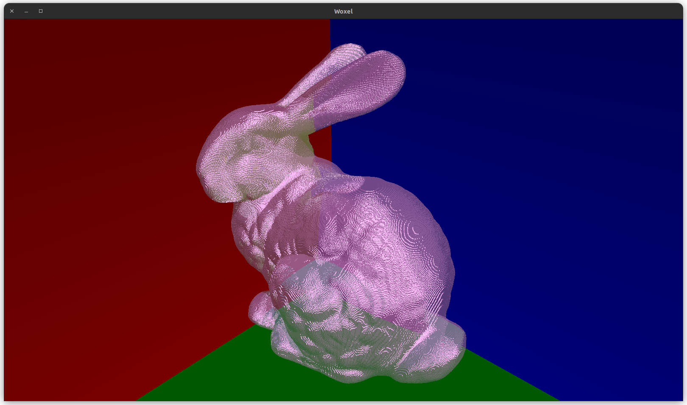
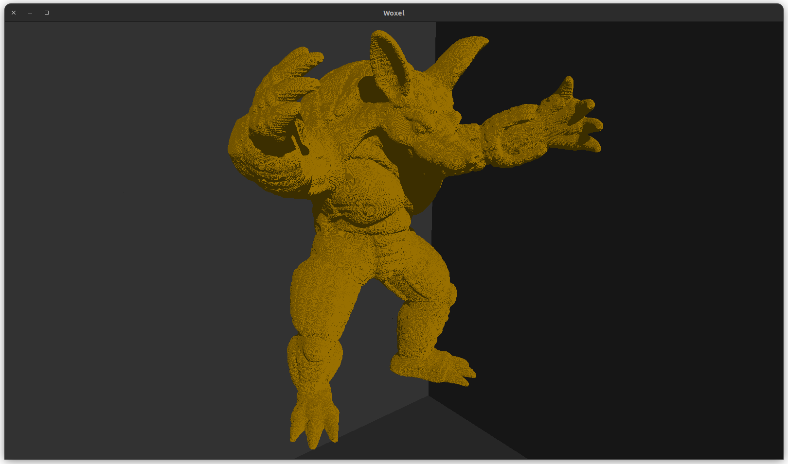
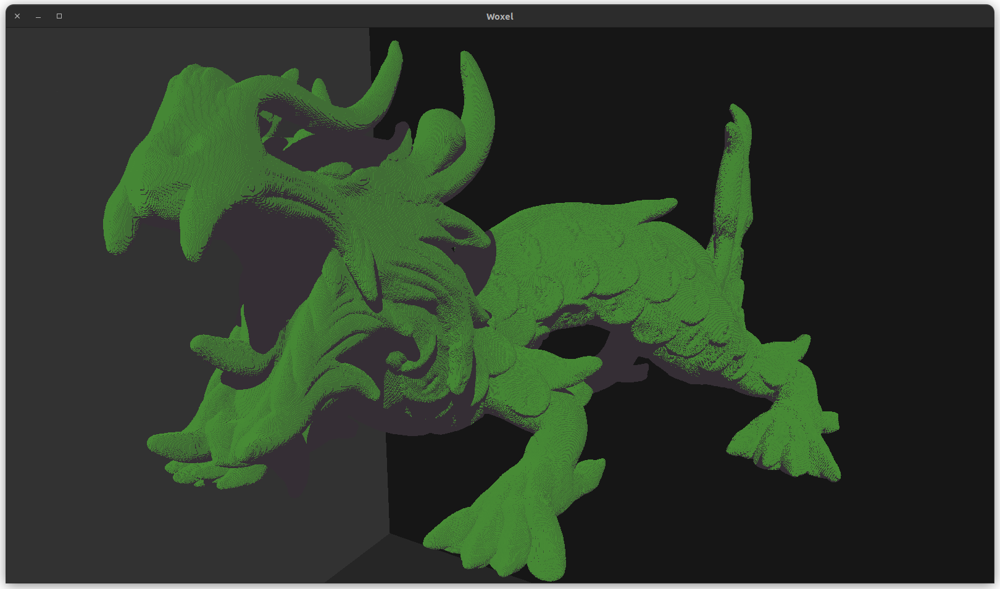
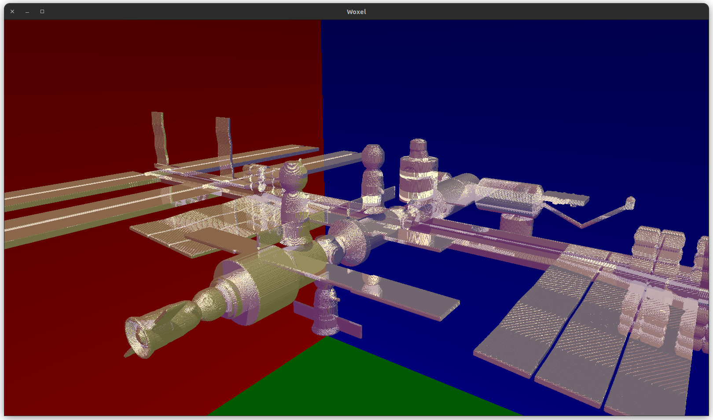
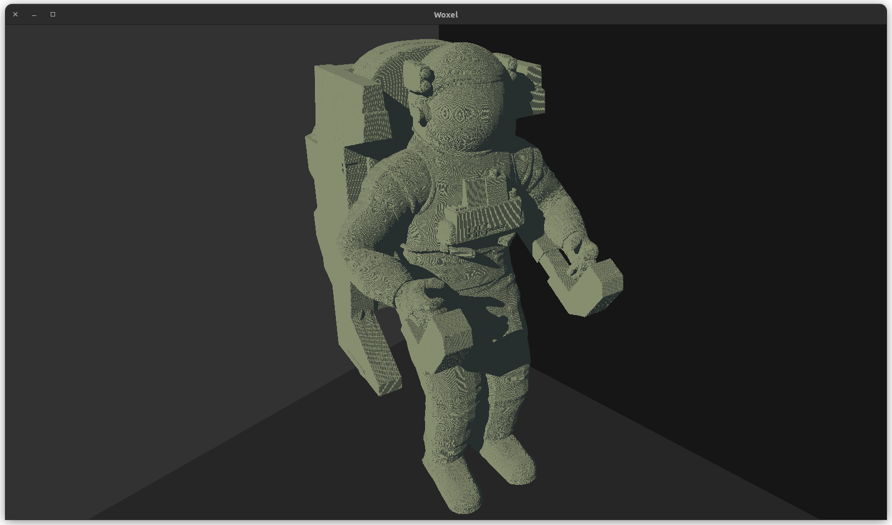
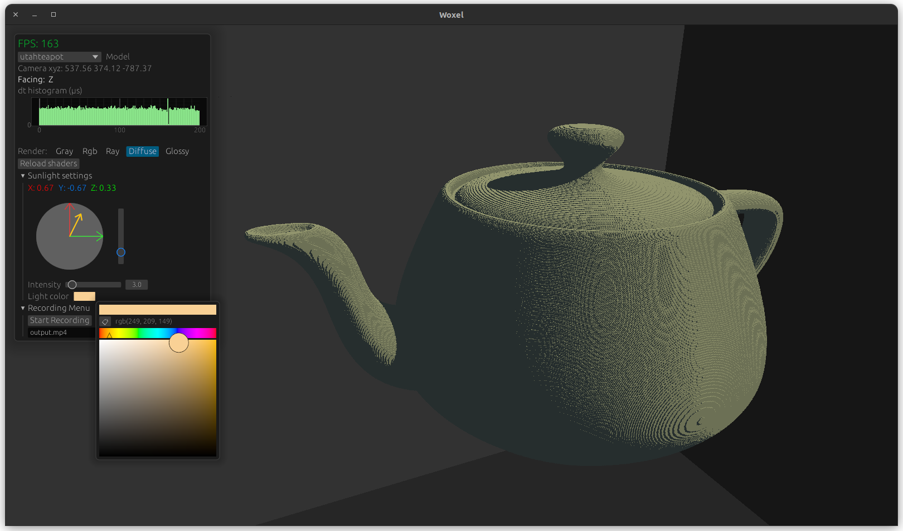
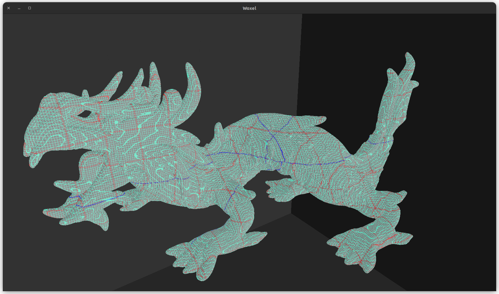
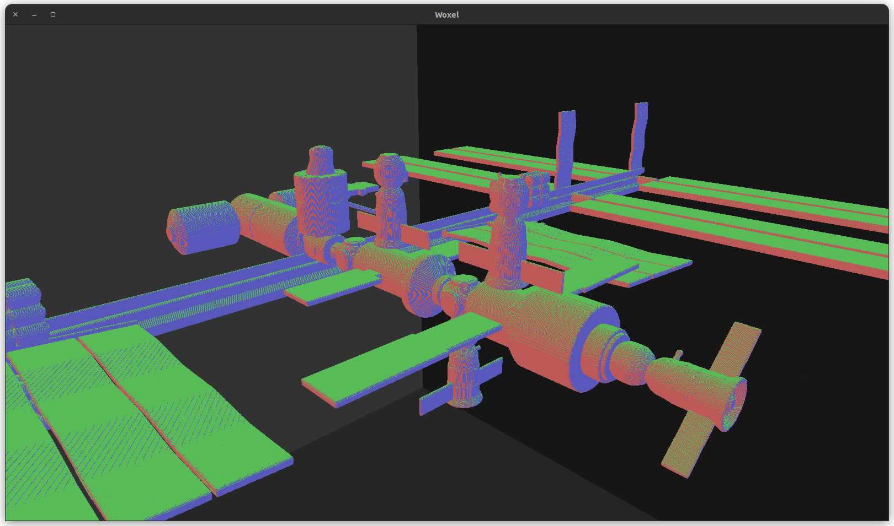

<a href="https://www.rust-lang.org/" target="_blank" rel="noopener noreferrer"></a>
<a href="https://github.com/gfx-rs/wgpu" target="_blank" rel="noopener noreferrer"></a>


# woxel
Web compatible voxel rendering engine. <br/>
The engine uses the VDB345[^1] data structure. It then performs a custom DDA based on the HDDA[^3] paper, combined with a grid SDF, in compute shaders, to render the model.

 

## Explanation
This project was developed as part of my university dissertation. For an in depth explination take a look at the: <br/>
- [Thesis](thesis/main.pdf) which covers the whole project in detail.
- Youtube [video](https://www.youtube.com/watch?v=ydc0edDHCF0&ab_channel=AaronTeodorPanaitescu) which explains the VDB data structure and some raycasting algorithms.

## Instalation
To run the project you will need the Rust nightly toolchain `1.75.0-nightly`[^2].
Easiest way to use the engine is with [cargo](https://doc.rust-lang.org/cargo/).<br/><br/>
For the **developer enviorment**, you can just run: 
``` shell
cargo run --release
```
<br/></br>
To build the **web enviorment**, you will need [wasm-pack](https://rustwasm.github.io/wasm-pack/installer/).</br>
You can then build the project, start a local server (doesn't matter how its served) and visit the `index.html` page.
```shell
wasm-pack build --target web
python3 -m http.server
```

## Use
You can load any `.vdb` model into the engine by adding it to the `assets/` folder.<br/> 
Then, on the dev pannel just select it from the dropdown menu. 

## Screenshots
<table>
  <tr>
    <td style="width: 50%;"></td>
    <td style="width: 50%;"></td>
  </tr>
  <tr>
    <td style="width: 50%;"></td>
    <td style="width: 50%;"></td>
  </tr>
</table>
<table>
  <tr>
    <td style="width: 50%;"></td>
    <td style="width: 50%;"></td>
  </tr>
  <tr>
    <td style="width: 50%;"></td>
    <td style="width: 50%;"></td>
  </tr>
</table>


[^1]: [Ken Museth. 2013. VDB: High-resolution sparse volumes with dynamic topology](https://www.museth.org/Ken/Publications_files/Museth_TOG13.pdf)
[^2]: The VDB data structure is inherintly generic in shape. To achieve this in Rust I used the nightly [generic_const_expr](https://doc.rust-lang.org/beta/unstable-book/language-features/generic-const-exprs.html) feature
[^3]: [Ken Museth. 2014. Hierarchical digital differential analyzer for efficient ray-marching in OpenVDB.](https://www.museth.org/Ken/Publications_files/Museth_SIG14.pdf) 
